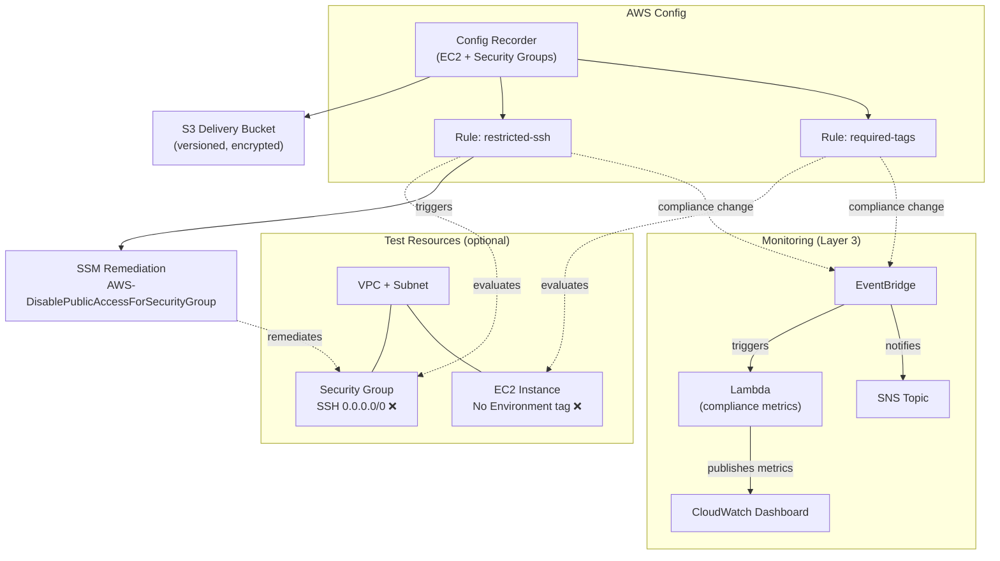
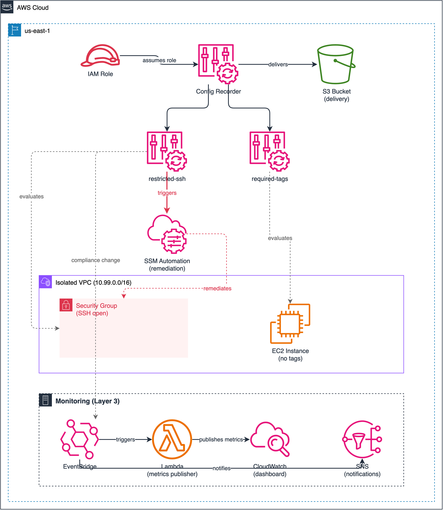

# Lab 01: Config Rules Compliance Baseline

Deploy AWS Config to monitor EC2-related resources and enforce compliance using two managed rules (`restricted-ssh` and `required-tags`), with SSM remediation for SSH violations.

## Objective

- Set up an AWS Config recorder scoped to EC2 instances and security groups
- Deploy two managed Config rules that check for common misconfigurations
- Configure SSM-based remediation to disable public SSH access on noncompliant security groups
- Create intentionally noncompliant test resources to validate rule evaluations

## Architecture





> To edit the diagram, open [`architecture.drawio`](./architecture.drawio) in [draw.io](https://app.diagrams.net/). Export as PNG to update `architecture.png`.

## Config Rules Deployed

| Rule | Source Identifier | Scope | What It Checks | Remediation |
|---|---|---|---|---|
| `restricted-ssh` | `INCOMING_SSH_DISABLED` | Security Groups | No inbound SSH (port 22) from 0.0.0.0/0 | SSM: `AWS-DisablePublicAccessForSecurityGroup` (manual trigger) |
| `required-tags` | `REQUIRED_TAGS` | EC2 Instances | `Environment=Dev` tag is present | None |

## Test Resources

When `create_test_resources = true` (default), the lab deploys intentionally noncompliant resources:

| Resource | Why It's Noncompliant | Expected Rule |
|---|---|---|
| Security group with SSH from 0.0.0.0/0 | Allows unrestricted SSH access | `restricted-ssh` |
| EC2 instance without `Environment` tag | Missing required tag | `required-tags` |

These resources are deployed in an isolated VPC (`10.99.0.0/16`) and can be skipped by setting `create_test_resources = false`.

## Remediating Non-Compliant Resources

After deploying with `create_test_resources = true`, wait 2-5 minutes for AWS Config to evaluate the rules. Both test resources will appear as **NON_COMPLIANT**. Use the steps below to bring each resource into compliance.

### Rule: `restricted-ssh` — Security Group with SSH from 0.0.0.0/0

**What's wrong:** The test security group allows inbound SSH (port 22) from `0.0.0.0/0`, which is flagged as unrestricted public access.

**Option A: Trigger SSM remediation (configured in Terraform)**

The lab configures an SSM remediation action (`AWS-DisablePublicAccessForSecurityGroup`) with manual triggering. To run it:

1. Open the [AWS Config console](https://console.aws.amazon.com/config/) > **Rules** > `restricted-ssh`
2. Select the noncompliant security group resource
3. Click **Remediate** to execute the SSM document

Or via CLI:

```bash
# Get the security group ID from Terraform output
SG_ID=$(terraform -chdir=infrastructure/terraform output -raw test_security_group_id 2>/dev/null)

# If output is not available, find it via AWS CLI
SG_ID=$(aws ec2 describe-security-groups \
  --filters "Name=group-name,Values=config-rules-compliance-baseline-test-open-ssh" \
  --query "SecurityGroups[0].GroupId" --output text --region us-east-1)

# Execute the SSM remediation document directly
aws ssm start-automation-execution \
  --document-name "AWS-DisablePublicAccessForSecurityGroup" \
  --parameters "{\"GroupId\":[\"$SG_ID\"],\"IpAddressToBlock\":[\"0.0.0.0/0\"]}" \
  --region us-east-1
```

**Option B: Fix manually via CLI**

```bash
# Revoke the offending inbound rule
aws ec2 revoke-security-group-ingress \
  --group-id "$SG_ID" \
  --protocol tcp --port 22 --cidr 0.0.0.0/0 \
  --region us-east-1
```

**Option C: Replace with a restricted CIDR**

```bash
# Revoke the open rule, then add a restricted one
aws ec2 revoke-security-group-ingress \
  --group-id "$SG_ID" \
  --protocol tcp --port 22 --cidr 0.0.0.0/0 \
  --region us-east-1

aws ec2 authorize-security-group-ingress \
  --group-id "$SG_ID" \
  --protocol tcp --port 22 --cidr <YOUR_IP>/32 \
  --region us-east-1
```

**Verification:** After remediation, re-evaluate the rule:

```bash
aws configservice start-config-rules-evaluation \
  --config-rule-names restricted-ssh --region us-east-1

# Wait ~1 minute, then check compliance
aws configservice get-compliance-details-by-config-rule \
  --config-rule-name restricted-ssh \
  --compliance-types COMPLIANT --region us-east-1
```

### Rule: `required-tags` — EC2 Instance Missing `Environment` Tag

**What's wrong:** The test EC2 instance is missing the `Environment=Dev` tag required by the rule.

**Remediate via CLI:**

```bash
# Get the instance ID
INSTANCE_ID=$(aws ec2 describe-instances \
  --filters "Name=tag:Name,Values=config-rules-compliance-baseline-test-no-env-tag" \
  --query "Reservations[0].Instances[0].InstanceId" --output text --region us-east-1)

# Add the missing tag
aws ec2 create-tags \
  --resources "$INSTANCE_ID" \
  --tags Key=Environment,Value=Dev \
  --region us-east-1
```

**Verification:** After adding the tag, re-evaluate:

```bash
aws configservice start-config-rules-evaluation \
  --config-rule-names required-tags --region us-east-1

# Wait ~1 minute, then check compliance
aws configservice get-compliance-details-by-config-rule \
  --config-rule-name required-tags \
  --compliance-types COMPLIANT --region us-east-1
```

> **Note:** Manual remediations (CLI/console) will drift from the Terraform state. The next `terraform plan` will show changes to restore the original noncompliant state. This is expected — the test resources are intentionally noncompliant. To reset, run `terraform apply` to recreate the noncompliant baseline.

## Deployment

### Prerequisites

- Terraform >= 1.5
- AWS CLI v2 configured with admin-level credentials
- Region: `us-east-1`

### Steps

```bash
cd infrastructure/terraform

# Copy and edit variables
cp terraform.tfvars.example terraform.tfvars
# Edit terraform.tfvars — set a globally unique config_bucket_name

# Deploy
terraform init
terraform plan
terraform apply
```

### Validation

```bash
# Check Config recorder status
aws configservice describe-configuration-recorders --region us-east-1

# Check rule compliance (wait 2-5 minutes after deploy for initial evaluations)
aws configservice describe-compliance-by-config-rule --region us-east-1

# View noncompliant resources for restricted-ssh
aws configservice get-compliance-details-by-config-rule \
  --config-rule-name restricted-ssh \
  --compliance-types NON_COMPLIANT \
  --region us-east-1

# View noncompliant resources for required-tags
aws configservice get-compliance-details-by-config-rule \
  --config-rule-name required-tags \
  --compliance-types NON_COMPLIANT \
  --region us-east-1
```

### Teardown

```bash
terraform destroy
```

## Cost Estimate

| Component | Estimated Monthly Cost |
|---|---|
| Config recorder (configuration items) | ~$1-3 |
| Config rule evaluations (2 rules) | ~$0.50 |
| S3 storage (Config snapshots) | ~$0.10 |
| EC2 t2.micro (test instance, if enabled) | ~$8.50 |
| **Total (with test resources)** | **~$10-12/month** |
| **Total (without test resources)** | **~$2-4/month** |

Always run `terraform destroy` when done to stop the Config recorder and avoid ongoing charges.

## Enhancement Layers

- [x] Layer 1: Infrastructure as Code (Terraform) — this lab
- [x] Layer 2: CI/CD Pipeline (GitHub Actions for terraform fmt/validate)
- [x] Layer 3: Monitoring (CloudWatch dashboard, compliance metrics Lambda, EventBridge + SNS notifications)
  - Dashboard shows compliance trend for `restricted-ssh` and `required-tags` rules
  - Email alert when someone opens SSH to 0.0.0.0/0 or deploys an untagged instance
- [ ] Layer 4: Finance Domain Twist (PCI-DSS / SOX compliance rules)
- [ ] Layer 5: Multi-Cloud Extension (Azure Policy equivalent)
