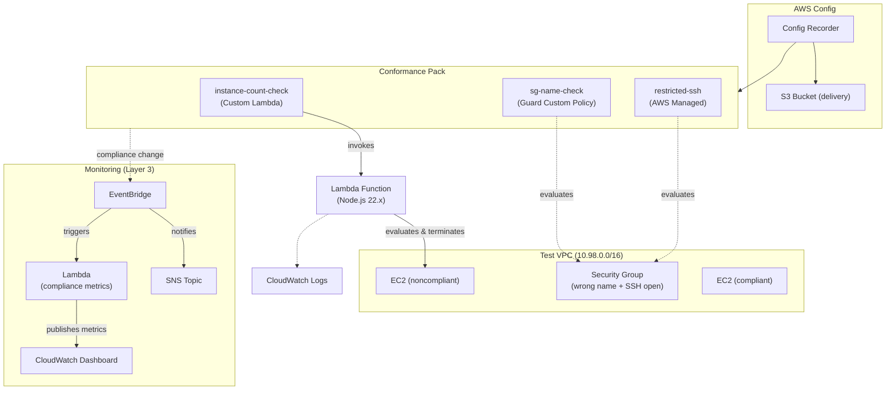
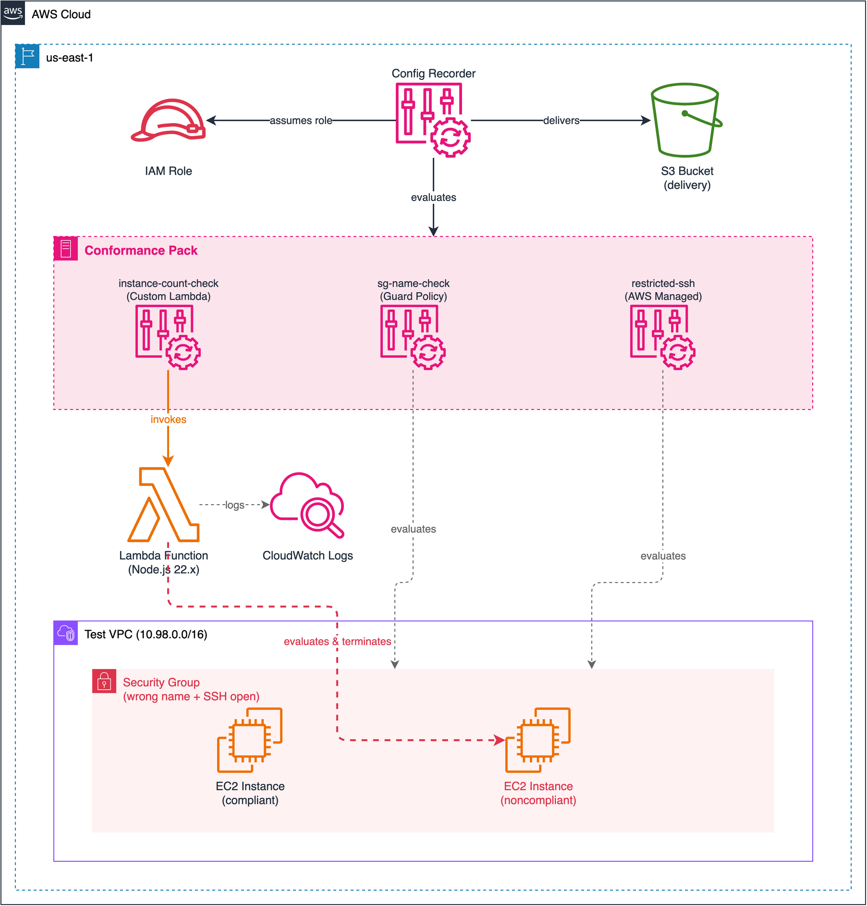

# Lab 02: Custom Rules and Conformance Packs

Deploy three types of AWS Config rules — Custom Lambda, Guard Custom Policy, and AWS Managed — bundled in a single conformance pack for at-scale compliance enforcement.

## Objective

- Write a **Custom Lambda rule** (Node.js 22.x) that checks EC2 instance count and auto-terminates excess instances
- Create a **Guard Custom Policy rule** that enforces security group naming conventions using declarative Guard DSL
- Bundle all three rule types (Lambda, Guard, Managed) into a **conformance pack** deployed as a single unit
- Compare rule mechanisms: Lambda flexibility vs Guard simplicity vs Managed convenience

## Architecture





> To edit the diagram, open [`architecture.drawio`](./architecture.drawio) in [draw.io](https://app.diagrams.net/). Export as PNG to update `architecture.png`.

## Conformance Pack Rules

All three rules are deployed exclusively via the conformance pack — no standalone `aws_config_config_rule` resources.

| Rule | Type | Scope | What It Checks | Remediation |
|---|---|---|---|---|
| `instance-count-check` | Custom Lambda | EC2 Instances | Only one running instance allowed; extras are NON_COMPLIANT | Lambda auto-terminates noncompliant instances |
| `sg-name-check` | Guard Custom Policy | Security Groups | SG must be named per `required_sg_name` variable | None (evaluate only) |
| `restricted-ssh` | AWS Managed | Security Groups | No unrestricted SSH (0.0.0.0/0 on port 22) | None (evaluate only) |

## How the Custom Lambda Rule Works

The Lambda function (`src/instance_count_check/index.mjs`) runs on Node.js 22.x using ESM with built-in AWS SDK v3:

1. Receives a Config rule invocation event with the triggering EC2 instance
2. Calls `ec2:DescribeInstances` to list all running/pending instances
3. Sorts instances by `LaunchTime` — the first-launched instance is COMPLIANT
4. All additional instances are marked NON_COMPLIANT and auto-terminated via `ec2:TerminateInstances`
5. Reports compliance status back via `config:PutEvaluations`

Edge cases handled:
- `OversizedConfigurationItemChangeNotification` — re-evaluates via API
- Deleted resources — returns `NOT_APPLICABLE`
- Non-EC2 resource types — returns `NOT_APPLICABLE`

## How the Guard Policy Rule Works

The Guard custom policy uses `guard-2.x.x` runtime with declarative rule syntax:

```
rule check_sg_name {
  resourceType == "AWS::EC2::SecurityGroup"
  configuration.groupName == "my-security-group"
}
```

Guard evaluates the Config configuration item directly — no Lambda function needed. The policy checks that the security group's `groupName` matches the required name. Any SG with a different name is NON_COMPLIANT.

## Conformance Pack Template

The conformance pack uses a YAML CloudFormation-style template with three `AWS::Config::ConfigRule` resources:

- **Parameters:** `InstanceCountCheckLambdaArn` — injected via Terraform `input_parameter` block
- **Lambda rule:** References the Lambda ARN via `Ref: InstanceCountCheckLambdaArn`
- **Guard rule:** Embeds the Guard policy inline via `CustomPolicyDetails.PolicyText`
- **Managed rule:** References `INCOMING_SSH_DISABLED` via `SourceIdentifier`

The conformance pack deploys all rules atomically. Rule evaluations are independent — each rule evaluates its scoped resources separately.

## Test Resources

When `create_test_resources = true` (default), the lab deploys intentionally noncompliant resources:

| Resource | Why It's Noncompliant | Expected Rules Triggered |
|---|---|---|
| Security Group (`test-open-ssh`) | Wrong name + allows SSH from 0.0.0.0/0 | `sg-name-check`, `restricted-ssh` |
| EC2 Instance #1 (compliant) | First-launched instance | None (passes `instance-count-check`) |
| EC2 Instance #2 (noncompliant) | Second instance exceeds count | `instance-count-check` (auto-terminated) |

> **Note:** The Lambda auto-terminates the second EC2 instance. Subsequent `terraform plan` will show it needs recreation. This is expected behavior — the self-remediation is working as designed.

## Deployment

### Prerequisites

- Terraform >= 1.5
- AWS CLI v2 configured with admin-level credentials
- Region: `us-east-1`

### Steps

```bash
cd infrastructure/terraform

# Copy and edit variables
cp terraform.tfvars.example terraform.tfvars
# Edit terraform.tfvars — set a globally unique config_bucket_name

# Deploy
terraform init
terraform plan
terraform apply
```

### Validation

```bash
# 1. Check Config recorder status
aws configservice describe-configuration-recorders --region us-east-1

# 2. Check conformance pack deployment status
aws configservice describe-conformance-pack-status \
  --conformance-pack-names custom-rules-conformance-packs-ec2-compliance \
  --region us-east-1

# 3. Wait 3-5 minutes for evaluation, then check compliance per rule
aws configservice get-compliance-details-by-config-rule \
  --config-rule-name instance-count-check \
  --region us-east-1

aws configservice get-compliance-details-by-config-rule \
  --config-rule-name sg-name-check \
  --region us-east-1

aws configservice get-compliance-details-by-config-rule \
  --config-rule-name restricted-ssh \
  --compliance-types NON_COMPLIANT --region us-east-1

# 4. Check Lambda logs for auto-termination
aws logs tail /aws/lambda/custom-rules-conformance-packs-instance-count-check \
  --since 30m --region us-east-1

# 5. Confirm second instance was terminated
aws ec2 describe-instances \
  --filters "Name=tag:Name,Values=*test-ec2-noncompliant*" \
  --query "Reservations[0].Instances[0].State.Name" \
  --output text --region us-east-1
# Expected: "terminated"
```

### Teardown

```bash
terraform destroy
```

> **Tip:** If the noncompliant EC2 was already terminated by the Lambda, Terraform destroy still succeeds — it handles already-terminated instances gracefully.

## Cost Estimate

| Component | Estimated Monthly Cost |
|---|---|
| Config recorder (configuration items) | ~$2-4 |
| Config rule evaluations (3 rules) | ~$1-2 |
| Lambda invocations | ~$0.00 |
| Conformance pack | $0 (pricing is per-rule eval) |
| EC2 t3.micro x2 (test, if enabled) | ~$15 |
| VPC (no NAT, no IGW) | $0 |
| **Total (with test resources)** | **~$18-21/month** |
| **Total (without test resources)** | **~$3-6/month** |

Always run `terraform destroy` when done.

## Enhancement Layers

- [x] Layer 1: Infrastructure as Code (Terraform) — this lab
- [x] Layer 2: CI/CD Pipeline (GitHub Actions for terraform fmt/validate)
- [x] Layer 3: Monitoring (CloudWatch dashboard, compliance metrics Lambda, EventBridge + SNS notifications)
  - Dashboard shows per-rule status for all 3 conformance pack rules
  - Surfaces violations that would otherwise be silently evaluated
- [ ] Layer 4: Finance Domain Twist (SOX/PCI-DSS conformance pack variant)
- [ ] Layer 5: Multi-Cloud Extension (Azure Policy Initiative equivalent)

## References

- [AWS Config Custom Lambda Rules](https://docs.aws.amazon.com/config/latest/developerguide/evaluate-config_develop-rules_lambda-functions.html)
- [AWS Config Custom Policy Rules (Guard)](https://docs.aws.amazon.com/config/latest/developerguide/evaluate-config_develop-rules_cfn-guard.html)
- [AWS CloudFormation Guard Syntax](https://docs.aws.amazon.com/cfn-guard/latest/ug/what-is-guard.html)
- [AWS Config Conformance Packs](https://docs.aws.amazon.com/config/latest/developerguide/conformance-packs.html)
- [Conformance Pack Template Structure](https://docs.aws.amazon.com/config/latest/developerguide/conformance-pack-organization-apis.html)
