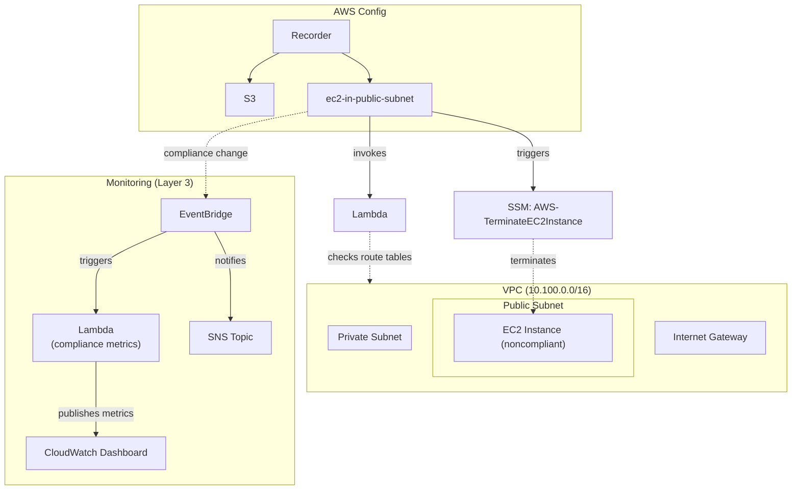
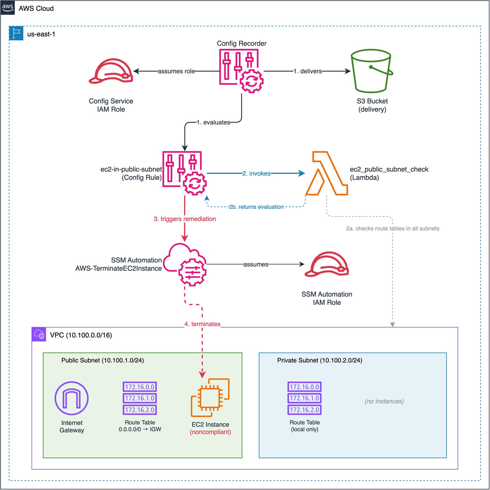

# Lab 03: SSM Automation EC2 Remediation

Deploy a custom Lambda-based AWS Config rule that detects EC2 instances running in public subnets, with automatic SSM Automation remediation (`AWS-TerminateEC2Instance`) to enforce private-subnet-only placement.

## Objective

- Create a VPC with public and private subnets to demonstrate subnet classification
- Write a custom Config rule Lambda that inspects route tables to detect public subnets
- Configure automatic SSM remediation to terminate noncompliant EC2 instances
- Validate the detect-evaluate-remediate pipeline end to end

## Architecture





> To edit the diagram, open [`architecture.drawio`](./architecture.drawio) in [draw.io](https://app.diagrams.net/). Export as PNG to update `architecture.png`.

## Config Rules Deployed

| Rule | Type | Scope | What It Checks | Remediation |
|---|---|---|---|---|
| `ec2-in-public-subnet` | Custom Lambda | EC2 Instances | Instance's subnet has no route to an Internet Gateway | SSM: `AWS-TerminateEC2Instance` (automatic) |

## How the Custom Rule Works

The Lambda function (`src/ec2_public_subnet_check/index.py`) evaluates each EC2 instance:

1. Extracts the instance's `subnetId` from the Config configuration item
2. Calls `ec2:DescribeRouteTables` filtered by `association.subnet-id`
3. Falls back to the VPC main route table if no explicit association exists
4. Checks if any route has `GatewayId` starting with `igw-` and destination `0.0.0.0/0` or `::/0`
5. Returns `NON_COMPLIANT` if the subnet is public, `COMPLIANT` if private

The rule triggers on `ConfigurationItemChangeNotification` and `OversizedConfigurationItemChangeNotification` events.

## Test Resources

When `create_test_resources = true` (default), the lab deploys an intentionally noncompliant EC2 instance:

| Resource | Why It's Noncompliant | Expected Rule |
|---|---|---|
| EC2 t3.micro in public subnet | Instance is in a subnet with a route to an IGW | `ec2-in-public-subnet` |

The test instance has an SSM instance profile attached (no SSH needed). After Config evaluation, SSM Automation will automatically terminate the instance.

> **Note:** Because remediation terminates the test instance, subsequent `terraform plan` will show the instance needs to be recreated. This is expected behavior — the auto-remediation is working as designed.

## Deployment

### Prerequisites

- Terraform >= 1.5
- AWS CLI v2 configured with admin-level credentials
- Region: `us-east-1`

### Steps

```bash
cd infrastructure/terraform

# Copy and edit variables
cp terraform.tfvars.example terraform.tfvars
# Edit terraform.tfvars — set a globally unique config_bucket_name

# Deploy
terraform init
terraform plan
terraform apply
```

### Validation

```bash
# 1. Check Config recorder status
aws configservice describe-configuration-recorders --region us-east-1

# 2. Wait 3-5 minutes for Config evaluation, then check compliance
aws configservice get-compliance-details-by-config-rule \
  --config-rule-name ec2-in-public-subnet \
  --compliance-types NON_COMPLIANT --region us-east-1

# 3. Verify SSM auto-remediation terminated the test EC2
aws ssm describe-automation-executions \
  --filters Key=DocumentNamePrefix,Values=AWS-TerminateEC2Instance \
  --region us-east-1

# 4. Confirm instance is terminated
INSTANCE_ID=$(terraform output -raw test_instance_id)
aws ec2 describe-instances \
  --instance-ids "$INSTANCE_ID" \
  --query "Reservations[0].Instances[0].State.Name" \
  --output text --region us-east-1
# Expected: "terminated"
```

### Teardown

```bash
terraform destroy
```

> **Tip:** If the test EC2 was already terminated by SSM, Terraform destroy will still succeed — it handles already-terminated instances gracefully.

## Cost Estimate

| Component | Estimated Monthly Cost |
|---|---|
| Config recorder (configuration items) | ~$2-4 |
| Config rule evaluations | ~$0.50 |
| Lambda invocations | ~$0.00 |
| EC2 t3.micro (test, if enabled) | ~$7.50 |
| VPC + IGW (no data transfer) | $0 |
| **Total (with test resources)** | **~$9-12/month** |
| **Total (without test resources)** | **~$2-4/month** |

No NAT Gateway is deployed (saves ~$32/month). Always run `terraform destroy` when done.

## Enhancement Layers

- [x] Layer 1: Infrastructure as Code (Terraform) — this lab
- [x] Layer 2: CI/CD Pipeline (GitHub Actions for terraform fmt/validate)
- [x] Layer 3: Monitoring (CloudWatch dashboard, compliance metrics Lambda, EventBridge + SNS notifications)
  - Tracks how often the public-subnet rule fires and whether SSM remediations succeed
  - Helps spot patterns (e.g., repeated launches in public subnets)
- [ ] Layer 4: Finance Domain Twist (PCI-DSS requirement for network segmentation)
- [ ] Layer 5: Multi-Cloud Extension (Azure Policy equivalent)
