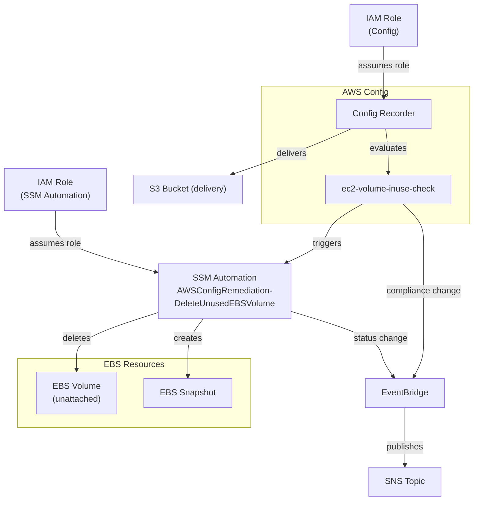
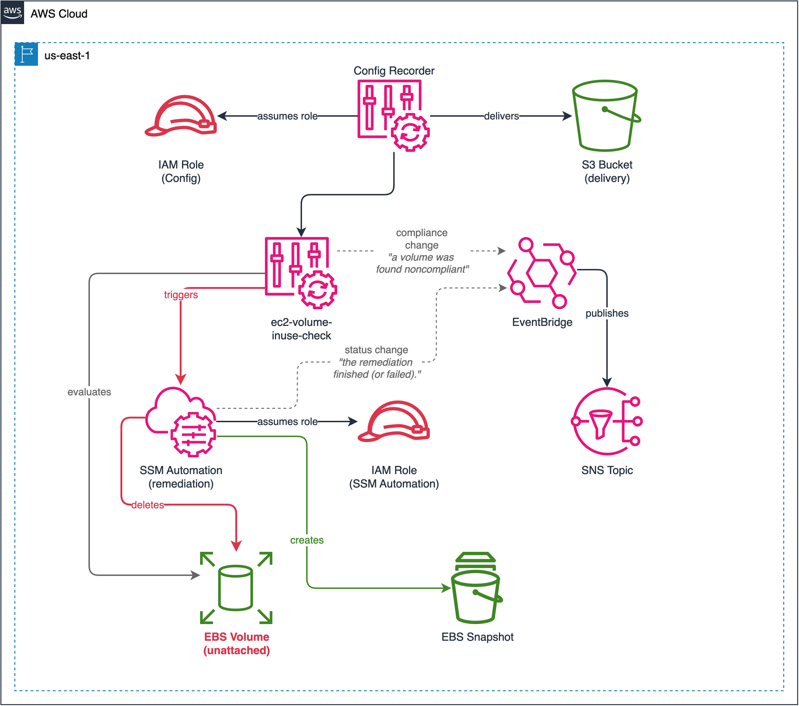

# Lab 04: EBS Volume Cleanup with Config Remediation

Detect unattached EBS volumes using the `ec2-volume-inuse-check` managed Config rule and auto-remediate with `AWSConfigRemediation-DeleteUnusedEBSVolume` SSM Automation (creates a snapshot, then deletes the volume). A **cost optimization** pattern.

## Objective

- Enable AWS Config to monitor EBS volumes for compliance
- Deploy the `ec2-volume-inuse-check` managed rule to flag unattached volumes
- Configure automatic SSM Automation remediation to snapshot and delete unused volumes
- Set up EventBridge rules and SNS notifications for compliance changes and remediation status
- Validate the end-to-end detect-evaluate-notify-remediate pipeline

## Architecture





> To edit the diagram, open [`architecture.drawio`](./architecture.drawio) in [draw.io](https://app.diagrams.net/). Export as PNG to update `architecture.png`.

## How It Works

1. **Detection** — AWS Config Recorder continuously tracks `AWS::EC2::Volume` configuration changes and delivers snapshots to S3.
2. **Evaluation** — The `ec2-volume-inuse-check` managed rule evaluates each EBS volume. Volumes not attached to any EC2 instance are flagged as **NON_COMPLIANT**.
3. **Notification** — EventBridge captures compliance change events and publishes them to an SNS topic. Subscribers (email) are notified immediately.
4. **Remediation** — Config triggers `AWSConfigRemediation-DeleteUnusedEBSVolume` SSM Automation, which:
   - Creates an EBS snapshot of the volume (if `CreateSnapshot = true`)
   - Deletes the unused volume
5. **Confirmation** — EventBridge captures the SSM Automation execution status change and publishes it to the same SNS topic.

## Config Rules Deployed

| Rule | Type | Scope | What It Checks | Remediation |
|---|---|---|---|---|
| `ec2-volume-inuse-check` | Managed (AWS) | `AWS::EC2::Volume` | Volume is attached to an EC2 instance | SSM: `AWSConfigRemediation-DeleteUnusedEBSVolume` (automatic) |

## SSM Remediation Parameters

| Parameter | Value | Description |
|---|---|---|
| `VolumeId` | `RESOURCE_ID` (from Config) | The noncompliant EBS volume ID |
| `AutomationAssumeRole` | SSM Automation IAM role ARN | Role with EC2 and SSM permissions |
| `CreateSnapshot` | `true` (configurable) | Creates a snapshot before deleting the volume |

## Test Resources

When `create_test_resources = true` (default), the lab deploys an intentionally noncompliant EBS volume:

| Resource | Why It's Noncompliant | Expected Rule |
|---|---|---|
| 1 GiB gp3 EBS volume (unattached) | Volume is not attached to any EC2 instance | `ec2-volume-inuse-check` |

> **Note:** Because remediation deletes the test volume, subsequent `terraform plan` will show the volume needs to be recreated. This is expected behavior — the auto-remediation is working as designed.

## Deployment

### Prerequisites

- Terraform >= 1.5
- AWS CLI v2 configured with admin-level credentials
- Region: `us-east-1`

### Steps

```bash
cd infrastructure/terraform

# Copy and edit variables
cp terraform.tfvars.example terraform.tfvars
# Edit terraform.tfvars — set a globally unique config_bucket_name

# Deploy
terraform init
terraform plan
terraform apply
```

If you set `notification_email`, confirm the SNS subscription via the email you receive.

### Validation

```bash
# 1. Check Config recorder status
aws configservice describe-configuration-recorders --region us-east-1

# 2. Wait 3-5 minutes for Config evaluation, then check compliance
aws configservice get-compliance-details-by-config-rule \
  --config-rule-name ec2-volume-inuse-check \
  --compliance-types NON_COMPLIANT --region us-east-1

# 3. Check SSM Automation execution
aws ssm describe-automation-executions \
  --filters Key=DocumentNamePrefix,Values=AWSConfigRemediation-DeleteUnusedEBSVolume \
  --region us-east-1

# 4. Verify volume is deleted and snapshot is created
aws ec2 describe-volumes \
  --volume-ids "$(terraform output -raw test_volume_id)" \
  --region us-east-1 2>&1 | head -5
# Expected: InvalidVolume.NotFound

aws ec2 describe-snapshots \
  --filters Name=tag:Name,Values=ebs-volume-cleanup-test-unattached \
  --owner-ids self --region us-east-1
```

### Teardown

```bash
terraform destroy

# Clean up orphaned snapshots created by SSM Automation
aws ec2 describe-snapshots --owner-ids self \
  --filters Name=description,Values='*Created by AWSConfig*' \
  --query 'Snapshots[].SnapshotId' --output text --region us-east-1 \
  | xargs -n1 aws ec2 delete-snapshot --snapshot-id
```

## Cost Estimate

| Component | Estimated Monthly Cost |
|---|---|
| Config recorder (configuration items) | ~$1-2 |
| Config rule evaluations | ~$0.50 |
| EBS volume (1 GiB gp3, test) | ~$0.10 |
| EBS snapshot (1 GiB, before deletion) | ~$0.05 |
| SNS + EventBridge | ~$0.00 |
| **Total (with test resources)** | **~$2-3/month** |
| **Total (without test resources)** | **~$1-2/month** |

Always run `terraform destroy` when done. Clean up orphaned snapshots to avoid ongoing storage charges.

## Enhancement Layers

- [x] Layer 1: Infrastructure as Code (Terraform) — this lab
- [ ] Layer 2: CI/CD Pipeline (GitHub Actions for terraform plan/apply)
- [ ] Layer 3: Monitoring (CloudWatch dashboard for compliance metrics, remediation success rate)
- [ ] Layer 4: Finance Domain Twist (SOX compliance — prevent deletion of financial data volumes)
- [ ] Layer 5: Multi-Cloud Extension (Azure Policy equivalent for unattached managed disks)

## References

- [ec2-volume-inuse-check](https://docs.aws.amazon.com/config/latest/developerguide/ec2-volume-inuse-check.html)
- [AWSConfigRemediation-DeleteUnusedEBSVolume](https://docs.aws.amazon.com/systems-manager-automation-runbooks/latest/userguide/automation-aws-delete-ebs-volume.html)
- [Monitor AWS Config with EventBridge](https://docs.aws.amazon.com/config/latest/developerguide/monitor-config-with-cloudwatchevents.html)
- [Delete unused EBS volumes (AWS Prescriptive Guidance)](https://docs.aws.amazon.com/prescriptive-guidance/latest/patterns/delete-unused-amazon-elastic-block-store-amazon-ebs-volumes-by-using-aws-config-and-aws-systems-manager.html)
